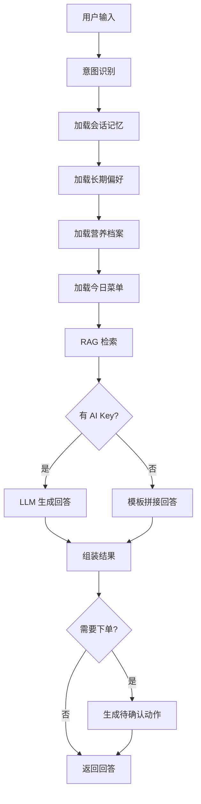

# 智慧食堂 Enterprise MVP

智慧食堂是一个校园餐饮全栈 MVP：学生端用于食堂导航、菜品检索、健康推荐、排行榜和 RAG 智能顾问；管理员端用于维护食堂、菜品、图片、批量导入、用户角色和审计日志。

## 线上地址

| 环境 | 地址 |
|------|------|
| 生产服务器 | http://101.34.216.33 |
| GitHub 仓库 | https://github.com/heshuoshuo0512/eat |

## 快速开始

### 安装依赖

```bash
npm install
```

### 启动前端

```bash
npm run dev
```

### 启动 API

```bash
npm run dev:api
```

### 同时启动前端和 API

```bash
npm run dev:full
```

默认 API 端口：`8787`，前端端口：`5173`。

## 默认账号

| 身份 | 用户名 | 密码 |
|------|--------|------|
| 学生 | `演示学生` | `student123` |
| 管理员 | `admin` | `admin123` |

登录页提供"学生端 / 管理员端"切换和演示账号按钮。

## 项目结构

```text
server/                    后端 API、数据库、安全、RBAC、缓存、上传、RAG
server/app.js              主应用（路由、Agent 运行时、工具注册/审计/权限、CRUD）
server/database.js         SQLite/PostgreSQL 数据库层
server/aiProvider.js       AI Provider：OpenAI-compatible API 调用、Function Calling
server/rag.js              RAG 检索：词法检索 + 向量检索 + 混合搜索
server/security.js         安全模块：JWT、密码 hash、AI key 加密/解密
server/rbac.js             RBAC 权限模型
src/                       Vue 前端和可复用领域逻辑
src/views/                 页面组件
src/stores/canteenStore.js Pinia 状态管理
src/services/apiClient.js  HTTP 客户端
src/domain/                推荐、排序、种子数据；不依赖浏览器
miniapp/                   微信小程序端（uni-app）
tests/                     测试套件
openapi/                   OpenAPI 合同
```

## 技术栈

| 层 | 技术 |
|------|------|
| 前端 | Vue 3, Vite, Pinia, Vue Router |
| 后端 | Node.js ESM, 原生 HTTP |
| 本地数据库 | SQLite via `node:sqlite` |
| 生产数据库路径 | PostgreSQL migration |
| 缓存路径 | 内存 fallback，Redis 可选 |
| 上传路径 | 本地 uploads fallback，S3/OSS/MinIO 可选 |
| AI | OpenAI-compatible API（小米 MiMo / DeepSeek / OpenAI） |
| RAG | 自研轻量 RAG（词法 + 向量 + 混合检索） |
| Agent | 自研 Agent 运行时（意图识别 + 工具调用 + 记忆 + 评测） |
| 小程序 | uni-app (Vue 3) |
| 部署 | Nginx + Node.js + SQLite，Docker Compose 可选 |
| 测试 | node:test |

## 当前能力

### 学生端

- 登录后进入主应用主页。
- 查看食堂、档口、菜品、价格、营养、标签和评分。
- 按关键词、价格、口味、清真筛选菜品。
- 提交菜品评价。
- 配置健康档案并获取规则推荐。
- 使用智能顾问：RAG 检索 + 可选 LLM 回答。
- 拍照识餐：上传餐食图片后识别菜品、评估营养。

### 管理端

- 管理食堂、档口、菜品 CRUD。
- 批量导入菜品 JSON 或 CSV。
- 菜单运营：发布菜单，维护供应量和售罄状态。
- 用户管理：调整角色。
- 审计日志：查看管理操作记录。
- AI 配置：保存 OpenAI-compatible API 配置。

### Agent 智能体（核心）

- **意图识别**：自动区分 meal_planning / order_status / operations。
- **9 个工具**：会话记忆、长期偏好、营养档案、今日菜单、RAG 餐 Advisor、订单查询、营业分析、下单提案、会话保存。
- **RAG 检索**：从真实菜品库检索，支持词法 + 向量 + 混合搜索。
- **记忆系统**：短期（会话上下文）+ 长期偏好。
- **动作中心**：高风险操作（下单）需用户确认，带 payload hash + 过期时间。
- **Function Calling**：AI Provider 原生调用 + deterministic 回退。
- **Eval 评测**：每次运行自动评分记录。
- **SSE 流式**：实时推送执行步骤。
- **多角色**：学生 vs 运营角色，工具权限隔离。

### 订单系统

- 创建订单、模拟支付、取餐码生成。
- 库存管理、销量回滚。
- 营业分析看板。

## 团队协作

### 仓库地址

```bash
git clone https://github.com/heshuoshuo0512/eat.git
```

### 分支规范

| 分支 | 用途 |
|------|------|
| `main` | 主分支，保持可运行状态 |
| `feature/xxx` | 功能分支，每人自己的开发分支 |
| `fix/xxx` | 修复分支 |

### 开发流程

```bash
# 1. 克隆仓库
git clone https://github.com/heshuoshuo0512/eat.git
cd eat

# 2. 安装依赖
npm install

# 3. 建自己的分支
git checkout -b feature/your-name

# 4. 开始开发
npm run dev          # 启动前端
npm run dev:api      # 启动后端

# 5. 提交代码
git add .
git commit -m "feat: 描述你的改动"
git push origin feature/your-name

# 6. 在 GitHub 上创建 Pull Request 合并到 main
```

### 更新服务器

代码合并到 main 后，在本地执行：

```bash
npm run build && scp -r dist ubuntu@101.34.216.33:/opt/smart-canteen/ && ssh ubuntu@101.34.216.33 "cd /opt/smart-canteen && git pull && pm2 restart smart-canteen"
```

## 服务器信息

| 项目 | 信息 |
|------|------|
| 云厂商 | 腾讯云轻量应用服务器 |
| 系统 | Ubuntu 24.04 LTS |
| 配置 | 4 核 4G |
| IP | 101.34.216.33 |
| SSH 用户名 | `ubuntu` |
| 项目目录 | `/opt/smart-canteen` |
| 进程管理 | PM2 |
| Web 服务器 | Nginx |

### 服务器管理命令

```bash
# SSH 登录
ssh ubuntu@101.34.216.33

# 查看后端状态
pm2 status

# 查看日志
pm2 logs smart-canteen

# 重启后端
pm2 restart smart-canteen

# 重启 Nginx
sudo nginx -s reload
```

## 常用命令

```bash
npm test                    # 运行测试
npm run build               # 构建前端
node --test tests/e2e.test.mjs           # E2E 测试
node --test tests/enterprise-api.test.mjs # 企业 API 测试
```

## 环境变量

| 变量 | 默认值 | 用途 |
|------|--------|------|
| `HOST` | `127.0.0.1` | API 监听地址 |
| `PORT` | `8787` | API 端口 |
| `SMART_CANTEEN_SECRET` | 进程内随机值 | JWT HMAC 密钥 |
| `SMART_CANTEEN_DB` | `data/smart-canteen.sqlite` | SQLite 文件路径 |
| `UPLOAD_DIR` | `uploads` | 本地上传目录 |
| `AI_API_KEY` | 无 | 可选：启动时默认 AI key |
| `AI_BASE_URL` | `https://api.openai.com/v1` | AI 服务地址 |
| `S3_BUCKET` | 无 | 配置后切换到 S3/MinIO 对象存储 |
| `S3_PUBLIC_URL` | 无 | 公共桶或 CDN 基础地址；私有桶不配置 |
| `PUBLIC_UPLOAD_BASE_URL` | `/uploads` | 本地上传的公开访问前缀 |

### 菜单、AI 配额与上传运维

- `GET /api/menus/today` 返回今日真实供餐；`source=menu` 表示来自已发布菜单，`source=fallback` 表示菜品库兜底。
- `POST /api/admin/menus/batch` 批量发布菜单时会事务化校验食堂和菜品归属，任一条失败则整批回滚。
- `GET /api/admin/ai-usage` 查看租户 AI 用量和 AI 月额度；额度耗尽时 AI 请求返回 `429`，不会静默绕过限制。
- 默认使用 `UPLOAD_DIR` 本地存储；设置 `S3_BUCKET` 后使用 S3/MinIO。对象键统一为 `tenant_id/upload-uuid.ext`，接口返回 `provider` 与 `storageKey`。
- 生产 bucket 私有化，通过 signed URL 提供限时访问；只有明确使用公共桶或 CDN 时才配置 `S3_PUBLIC_URL`。

## RAG 和 Agent 设计

当前实现是"真实菜品库 RAG + 规则推荐 + 可选真实 AI"：

1. 从数据库真实菜品构建文档。
2. 有 AI key 时调用 OpenAI-compatible embedding；否则使用本地确定性 embedding。
3. 返回检索引用 `citations`。
4. 用健康档案和问题意图做可解释规则推荐。
5. 有可用 AI key 时，LLM 基于 citations 生成自然语言建议；没有 key 时回退模板回答。

约束：Agent 不允许编造数据库不存在的菜。

### Agent 架构图



## 测试覆盖

已有测试覆盖：

- 推荐算法
- API 登录、RBAC、CRUD、错误处理
- 企业 API：管理员编辑/删除/导入、上传、RAG、Agent
- E2E/集成流程
- 前端生产表单校验
- 拍照识餐
- 部署和文档合同

### CI 质量门禁

`.github/workflows/ci.yml` 依次执行 `npm ci`、`npm test`、`npm run build`、`docker compose config --quiet` 和 `docker build -t smart-canteen-ci .`。任一步失败都会阻止合并。

## 生产注意事项

- 配置稳定高强度 `SMART_CANTEEN_SECRET`。
- 生产建议使用 PostgreSQL。
- 上传建议切到 S3/MinIO/OSS。
- 使用 HTTPS。
- 配置数据库备份。

## 小程序迁移路径

- 保留 `src/domain` 推荐逻辑。
- 保留 `/api/*` 合同。
- 将 Vue 页面替换成 uni-app/小程序页面。
- 复用状态结构和 API client 思路。
- Agent/RAG、RBAC、数据库、审计不需要重写。
