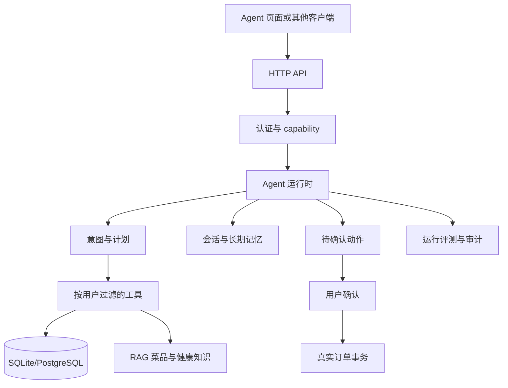

# 智慧食堂 Agent 团队协作与 Claude Code 开发指南

> 面向：第一次参与本项目 Agent/RAG 开发的后端、算法和全栈开发者  
> 项目：智慧食堂 Smart Canteen  
> 目标：在不破坏权限、租户隔离、订单安全和事实约束的前提下，完成 Agent 功能开发、评测、Review 与上线。

---

## 一、先读结论

智慧食堂 Agent 不是一个可以直接执行任意函数的聊天机器人，而是一个**受服务端权限、真实菜单数据、用户记忆和高风险动作确认约束的业务助手**。

开发时必须遵守：

1. **服务端是唯一权威**：前端不能决定权限、价格、库存、订单状态、动作是否执行或推荐是否真实可用。
2. **先查真实数据，再生成回答**：菜单、订单、营养档案和引用必须来自当前租户数据库或受控知识库。
3. **高风险动作只提议，不自动执行**：创建订单必须先生成 `pending` 动作，再由用户显式确认。
4. **所有用户数据按租户和用户隔离**：查询会话、记忆、订单和动作时不得只按对象 ID 查询。
5. **模型输出不是授权凭证**：LLM 只能选择工具和生成建议，不能绕过 `requireCapability`、RBAC 或业务校验。
6. **评测是交付物的一部分**：新增工具、提示词、路由或记忆逻辑，必须补充正例、越权反例和高风险场景验证。
7. **密钥永不进入响应、日志、事件或测试报告**：AI Key 只在服务端加密保存和运行时解密。

第一阶段推荐任务：先运行现有测试、检查接口契约和补充评测用例，不要直接改 `server/app.js` 的核心执行链。

---

## 二、Agent 在项目中的位置

### 2.1 请求链路



### 2.2 当前实现层

| 层 | 文件 | 职责 |
| --- | --- | --- |
| HTTP 与业务运行时 | `server/app.js` | Agent 路由、意图判断、工具编排、记忆、动作确认、评测记录、SSE |
| LangChain 实现 | `server/agent-langchain.js` | ReAct Agent、动态工具注册、工具过滤、BufferMemory、实验性回退 |
| RAG | `server/rag.js` | 当前菜品与知识库检索、事实引用、饮食建议 |
| LangChain RAG | `server/rag-langchain.js` | RetrievalQA、混合检索及失败回退能力 |
| 评测 | `server/evaluation-ragas.js` | faithfulness、answer relevancy、context precision、context recall |
| 数据库 | `server/database.js`、`server/migrations.js`、`server/migrations/` | Agent 表、业务表和迁移 |
| 前端 | `src/views/AgentView.vue` | 展示回答、计划、步骤、引用、动作和错误 |
| 架构说明 | `docs/RAG-AGENT-ARCHITECTURE.md` | LangChain、pgvector、RAGAS 的设计背景 |
| 任务分配 | `docs/Agent助手任务分配计划.md` | 新成员的验收和低风险任务顺序 |

### 2.3 两条运行路径

项目同时保留两种 Agent 形态：

- **当前业务 API 运行时**：`server/app.js` 中的 `runCanteenAgent`。它负责项目现有的完整响应结构、租户数据、订单动作、记忆和评测记录。
- **LangChain 实现**：`server/agent-langchain.js` 中的 `createCanteenAgent`、`runCanteenAgent`、`ToolRegistry`。它提供 ReAct 和动态工具注册；模型或解析失败时回退到业务运行时。

新增业务能力时，先确认调用方使用哪条路径。不要只在 LangChain 注册工具，却忘记 `app.js` 的业务工具目录、权限和结构化响应。

---

## 三、目录和核心文件阅读顺序

第一次接手 Agent，按以下顺序阅读：

1. `docs/RAG-AGENT-ARCHITECTURE.md`
2. `docs/Agent助手任务分配计划.md`
3. `server/app.js` 中 `runCanteenAgent`、动作、记忆、SSE 和 Agent 路由
4. `server/agent-langchain.js` 中 `ToolRegistry` 和 `registerCanteenTools`
5. `server/rag.js`、`server/rag-langchain.js`
6. `tests/agent-assistant.test.mjs`
7. `tests/agent-platform.test.mjs`
8. `tests/agent-governance.test.mjs`
9. `tests/agent-final.test.mjs`、`tests/agent-enterprise.test.mjs`、`tests/rag-agent-industry.test.mjs`
10. 最后再看 `src/views/AgentView.vue` 和 API 客户端

核心文件属于高冲突区。修改前先通知队友，修改后必须运行针对性测试。

---

## 四、两人或多人协作分工

### 4.1 推荐分工

| 角色 | 主要职责 | 不应独自决定 |
| --- | --- | --- |
| Agent 运行时开发者 | 意图、计划、工具编排、结构化响应、SSE | 权限放宽、自动下单 |
| 工具与数据开发者 | 工具 SQL、RAG 数据、菜单/订单/档案映射 | 跨租户查询、绕过服务层权限 |
| 评测与安全开发者 | 测试用例、越权反例、动作生命周期、指标 | 删除安全断言或降低阈值 |
| 前端协作者 | Agent 页面、步骤、引用、动作确认 UI | 在前端直接创建订单或判断权限 |

### 4.2 推荐分支

```text
feat/agent-runtime       Agent 编排和响应结构
feat/agent-tool-<name>   单个工具或 RAG 数据能力
feat/agent-evals         评测用例和测试
fix/agent-security       权限、隔离、动作安全修复
```

一个分支尽量只解决一个主题。工具、数据库迁移和 API 合同同时变化时，在 PR 描述中明确顺序和回滚方式。

### 4.3 高冲突文件规则

以下文件修改前必须在协作群说明范围：

- `server/app.js`
- `server/agent-langchain.js`
- `server/database.js`
- `server/migrations.js`
- `server/rag.js`
- `server/rbac.js`
- `openapi/smart-canteen.yaml`
- Agent 测试公共初始化代码

不要为了格式化整个文件而产生无关 diff。不要把业务修复和依赖升级混在同一个 PR。

---

## 五、Agent API 契约

所有需要登录和使用 Agent 的接口都应通过 `agent:use` capability。评测管理接口还要求操作角色。

### 5.1 主要接口

| 方法 | 路径 | 用途 | 权限 |
| --- | --- | --- | --- |
| `POST` | `/api/agent/assistant` | 非流式完整运行 | `agent:use` |
| `POST` | `/api/agent/stream-run` | 运行并实时返回 SSE | `agent:use` |
| `GET` | `/api/agent/stream?sessionId=...` | 读取会话事件 SSE | `agent:use` |
| `GET` | `/api/agent/events?sessionId=...` | 读取会话事件 JSON | `agent:use` |
| `POST` | `/api/agent/meal-advisor` | 单次饮食建议和引用 | 当前实现允许匿名，按调用场景验证 |
| `GET` | `/api/agent/actions` | 当前用户动作中心 | `agent:use` |
| `POST` | `/api/agent/actions/:id/confirm` | 确认动作 | `agent:use` |
| `POST` | `/api/agent/actions/:id/reject` | 拒绝动作 | `agent:use` |
| `GET` | `/api/agent/memory` | 读取自己的长期记忆 | `agent:use` |
| `PUT` | `/api/agent/memory` | 更新自己的长期记忆 | `agent:use` |
| `DELETE` | `/api/agent/memory` | 清空自己的长期记忆 | `agent:use` |
| `GET` | `/api/agent/evals` | 查看运行指标 | `agent:use` + 操作角色 |
| `GET` | `/api/agent/eval-cases` | 列出评测用例 | `agent:use` + 操作角色 |
| `POST` | `/api/agent/eval-cases` | 创建评测用例 | `agent:use` + 操作角色 |
| `PUT` | `/api/agent/eval-cases/:id` | 更新评测用例 | `agent:use` + 操作角色 |
| `DELETE` | `/api/agent/eval-cases/:id` | 删除评测用例 | `agent:use` + 操作角色 |
| `POST` | `/api/agent/eval-cases/:id/run` | 运行评测用例 | `agent:use` + 操作角色 |

操作角色由服务端 `AGENT_OPERATION_ROLES` 决定，当前包括：`admin`、`super_admin`、`tenant_admin`、`canteen_admin`、`stall_admin`、`operator`、`finance`、`auditor`。不要在前端复制或自行扩展这份列表。

### 5.2 `/api/agent/assistant` 请求

```json
{
  "query": "我想吃不辣的低脂午餐",
  "sessionId": "可选，会话续接"
}
```

`question` 也被当前运行时兼容，但新调用优先使用 `query`。空问题返回错误，不得让模型自行猜测任务。

### 5.3 结构化响应

成功响应至少保持以下字段：

```json
{
  "sessionId": "agent-session-...",
  "answer": "...",
  "intent": "meal_planning",
  "steps": [],
  "toolResults": {},
  "citations": [],
  "plan": {
    "goal": "...",
    "intent": "meal_planning",
    "riskLevel": "low",
    "steps": [],
    "guardrails": []
  },
  "mealPlan": {},
  "summary": {},
  "actions": [],
  "memory": {},
  "personas": [],
  "eval": {}
}
```

字段语义：

- `intent`：`meal_planning`、`order_status`、`operations` 或 `general_canteen`。
- `steps`：实际运行的工具、状态、风险级别和耗时；不是模型声称执行的步骤。
- `toolResults`：工具结果及目录、路由和汇总信息；不得包含秘密。
- `citations`：回答依据的真实菜品、档口、食堂或知识库引用。
- `plan`：目标、工具步骤和安全护栏。
- `actions`：导航动作或待确认业务动作。
- `eval`：`groundednessScore`、`toolSuccessRate`、`safetyScore`、`riskLevel`。

新增字段可以向后兼容地增加，但不要删除已有字段、改变字段类型或把数据库原始行直接暴露给前端。

### 5.4 SSE 事件

`POST /api/agent/stream-run` 发送：

```text
agent.run.started
agent.plan
agent.tool.finished
agent.tool.error
agent.action_required
agent.summary
agent.eval
agent.done
agent.error
```

`GET /api/agent/stream` 发送会话回放事件：

```text
agent.session
agent.message
agent.action
agent.event
agent.snapshot
agent.done
```

每个 `data:` 行必须是可解析 JSON。事件中不得写入 API Key、完整凭证、未脱敏内部错误或不属于当前用户的数据。

---

## 六、内置工具与扩展规则

### 6.1 当前工具目录

| 工具 | 类别 | 风险 | 说明 |
| --- | --- | --- | --- |
| `session.load` | memory | low | 读取当前用户当前租户的会话上下文 |
| `memory.long_term` | memory | low | 读取口味、饮食禁忌等长期偏好 |
| `profile.load` | context | low | 读取当前用户营养档案 |
| `menu.today` | canteen | low | 读取已发布的今日菜单 |
| `rag.meal_advisor` | knowledge | low | 基于检索和营养分析生成饮食建议 |
| `orders.mine` | order | low/业务查询 | 只查询当前用户自己的订单 |
| `orders.analytics` | analytics | low/受限 | 读取营业分析，仅操作角色可用 |
| `order.create.propose` | order | high | 生成创建订单的待确认提议 |
| `session.save` | memory | low | 保存会话摘要 |

工具元数据至少包括：`name`、`description`、`category`、`schema`、`riskLevel`、`requiresConfirmation`，受角色限制的工具还要有 `roles`。

### 6.2 新增工具模板

```javascript
registry.register({
  name: 'menu.supply_status',
  description: '读取当前租户今日菜单的供应状态',
  category: 'canteen',
  riskLevel: 'low',
  requiresConfirmation: false,
  roles: null,
  schema: {
    type: 'object',
    properties: { date: { type: 'string' } },
  },
  func: async ({ date }) => {
    // 1. 从闭包取得 tenantId 和当前用户
    // 2. SQL 的每个业务表都带 tenant_id 条件
    // 3. 只返回必要字段
    // 4. 对不存在的数据返回明确的空结果
    return { date, items: [] };
  },
});
```

注意：上例是结构模板，不是应提交的占位实现。真正提交时必须接入真实数据库并补测试。

### 6.3 工具实现不变量

- 工具必须是幂等查询，或明确声明副作用。
- 查询必须包含 `tenant_id`；用户资源必须同时包含 `user_id`。
- 工具不能信任模型传入的 `userId`、`tenantId`、价格、库存或角色；这些值来自服务端上下文和数据库。
- 工具结果只保留 Agent 回答需要的字段，避免返回密码哈希、内部配置和无关个人信息。
- 失败要返回可诊断的工具错误并记录 `agent.tool.error`，不能静默伪造成功结果。
- 高风险工具必须 `requiresConfirmation: true`，并通过动作表进入确认流程。
- 角色限制必须在服务端 `assertAgentToolAllowed` 或等效权限函数执行，不能只在工具目录中标记。

---

## 七、权限、租户隔离和数据边界

### 7.1 权限判断顺序

1. 从 Bearer token 得到服务端用户。
2. 用 `requireCapability(db, req, 'agent:use')` 检查 Agent 能力。
3. 对受限工具再次检查角色和业务范围。
4. 使用 `tenantIdFor(user)` 获得租户范围。
5. 查询时同时限制租户、用户、会话或资源 ID。
6. 对写操作执行业务校验、事务和审计。

### 7.2 必须覆盖的越权反例

- 未登录访问 `/api/agent/assistant` 返回 `401`。
- 学生访问评测管理接口返回 `403`。
- 学生不能调用营业分析工具。
- 用户 A 不能读取用户 B 的 `agent_sessions`、`agent_memories`、`agent_actions` 或订单。
- 租户 A 的同名资源不能被租户 B 通过 ID 读取。
- 用户 B 不能确认用户 A 的动作，即使知道动作 ID。
- 修改动作载荷后，确认必须因 `payloadHash` 不匹配而失败。

### 7.3 医疗和健康边界

饮食建议只能基于营养档案、菜单和知识库给出一般性建议。不得把 Agent 说法包装成诊断、处方或医疗保证；不确定时应明确建议咨询专业人士。

---

## 八、高风险动作生命周期

当前创建订单动作的状态流转：

```text
pending ──用户确认──> confirmed
   │
   ├──用户拒绝──> rejected
   └──超过有效期──> expired
```

### 8.1 创建动作

`createAgentAction` 会：

1. 对载荷执行 `sanitizeAgentPayload`。
2. 对规范化 JSON 计算 SHA-256 `payloadHash`。
3. 写入 `agent_actions`，状态为 `pending`。
4. 设置默认过期时间，目前为创建后约 30 分钟。
5. 返回 `requiresConfirmation: true` 和 `riskLevel: high`。

创建动作不能直接调用 `createOrder`。

### 8.2 确认动作

`confirmAgentAction` 必须重新检查：

- 动作属于当前租户和当前用户。
- 状态仍是 `pending`。
- 没有过期。
- 数据库载荷的哈希仍与保存的 `payloadHash` 相同。
- 订单商品、价格、库存和用户归属仍通过正常订单业务函数校验。
- 创建订单和库存变更在正确事务边界内完成。

确认成功后状态为 `confirmed`，并在结果中返回真实订单；待处理列表中不再显示该动作。

### 8.3 拒绝和重复操作

- 拒绝将状态置为 `rejected`。
- 已确认、已拒绝或已过期的动作不能再次确认。
- 任何动作状态变更都应审计：`CONFIRM_ACTION`、`REJECT_ACTION`。
- 不要通过删除动作记录来“隐藏”失败或拒绝结果。

---

## 九、记忆治理

### 9.1 两类记忆

- **会话记忆**：`agent_sessions`、`agent_messages`，用于当前对话上下文和 SSE 回放。
- **长期偏好**：`agent_memories`，当前业务运行时保存 `summary` 和 `preferences_json`。

LangChain 的 `BufferMemory`、`ConversationSummaryMemory` 和 `EpisodicMemory` 属于运行层能力。接入持久化时必须重新确认当前数据库 schema、租户字段和清理策略，不要照搬旧示例 SQL。

### 9.2 当前自动提取的偏好

当前运行时会从用户问题提取有限偏好：

| 用户表达 | 偏好 |
| --- | --- |
| 不吃辣、不要辣、少辣 | `taste: 不辣` |
| 清真 | `halalOnly: true` |
| 减脂、低脂 | `goal: fatLoss` |
| 增肌、高蛋白 | `goal: muscleGain` |

这不是通用事实抽取器。新增偏好必须定义允许键、类型、长度、冲突覆盖规则和测试。

### 9.3 记忆安全规则

- 记忆按 `tenant_id + user_id` 隔离。
- 用户只能 GET、PUT、DELETE 自己的记忆。
- `summary` 和字符串偏好必须限长；键名必须经过白名单或格式校验。
- 不保存密码、Token、API Key、支付凭证、完整健康敏感信息或模型内部思维链。
- DELETE 只清空当前用户自己的记忆。
- 记忆只作为上下文，不能替代当前菜单、库存、权限和订单数据库。

---

## 十、RAG 与事实约束

### 10.1 推荐数据来源优先级

1. 当前租户今日已发布菜单。
2. 当前租户的菜品、档口和食堂数据。
3. 当前用户营养档案和已保存偏好。
4. 受控健康知识库。
5. 模型生成的解释性文字。

模型不能凭空补充不存在的菜品、价格、供应状态、营业时间或健康指标。无法从数据得到结论时要明确说明数据不足。

### 10.2 引用要求

`citations` 应指向真实数据对象或知识文档，并可被开发者追踪。推荐回答至少能解释：

- 推荐了哪个菜品。
- 菜品来自哪个菜单、档口或食堂。
- 使用了哪条健康知识或营养信息。
- 为什么符合用户的目标、口味或预算。

### 10.3 混合检索和向量库

架构文档描述了 SQLite 词法检索、确定性本地 embedding、可选远程 embedding、PostgreSQL/pgvector、HNSW 和混合检索。迁移到 pgvector 时必须同时验证：

- migration 可重复执行。
- 旧数据迁移不会丢失租户和文档来源。
- 向量维度与 embedding 模型一致。
- 向量检索失败时仍有安全的词法或业务数据回退。
- RAG 结果不会越过租户过滤。

不要把“启用了向量检索”写成“回答一定正确”。仍需使用引用和评测验证事实性。

---

## 十一、评测体系

### 11.1 自动运行指标

每次 Agent 运行记录到 `agent_eval_runs`，包括：

- `groundednessScore`：是否有引用和事实依据。
- `toolSuccessRate`：工具成功数 / 工具总数。
- `safetyScore`：高风险动作是否正确要求确认。
- `riskLevel`：本次计划风险级别。
- `latencyMs`：运行耗时。

这些指标用于发现回归，不代表完整的模型质量评估。

### 11.2 评测用例

`agent_eval_cases` 支持以下约束：

- `name`、`query`
- `expectedIntent`
- `requiredTools`
- `forbiddenTools`
- `expectAction`
- `enabled`

运行后写入 `agent_eval_case_runs`，检查意图、必需工具、禁用工具和动作结果，并返回 `passed`、`score`、`checks`。

### 11.3 RAGAS 指标

`server/evaluation-ragas.js` 提供：

- Faithfulness：回答是否被上下文支持。
- Answer Relevancy：回答是否直接回应问题。
- Context Precision：检索上下文是否相关且排序合理。
- Context Recall：上下文是否覆盖参考答案所需信息。

评测模型调用需要已配置 AI Provider。没有配置时不要把默认分数当作真实质量结论。

### 11.4 最小回归矩阵

| 场景 | 期望 |
| --- | --- |
| 未登录问“今天吃什么” | `401` |
| 学生问今日午餐 | `meal_planning`，有菜单、计划、引用 |
| 学生问“我的订单” | 仅返回当前用户订单 |
| 运营角色问营业数据 | 允许使用 `orders.analytics` |
| 普通学生问营业数据 | 不调用受限工具，明确权限边界 |
| “帮我下单” | 产生 high-risk pending 动作，不创建订单 |
| 确认动作 | 创建真实订单，状态 `confirmed` |
| 拒绝动作后再次确认 | `400`，不创建订单 |
| 修改动作载荷后确认 | `409`，哈希校验失败 |
| 用户 A 清空记忆 | 用户 B 记忆不变 |
| AI 设置存在 | 响应和 SSE 不泄露 Key |
| 空查询 | `400` |

---

## 十二、Claude Code 开发流程

### 12.1 开始前

```powershell
npm ci
npm run dev:api
```

需要前后端联调时另开终端：

```powershell
npm run dev:full
```

先查看当前分支和工作区，再阅读目标文件。不要让 Claude Code 在不了解租户、权限和动作契约时直接改核心代码。

### 12.2 推荐提示词

#### 只读分析

```text
请先只读分析 Agent 当前实现，不要修改文件。
目标：确认 <问题>。
必须检查：server/app.js、server/agent-langchain.js、相关 migration 和 tests/agent-*.test.mjs。
请列出当前行为、数据边界、已有测试、潜在回归点和最小修改范围。
```

#### 新增低风险工具

```text
为智慧食堂新增一个只读 Agent 工具 <tool.name>。
先复用现有 ToolRegistry、tenantIdFor、权限检查和数据库访问模式。
禁止信任模型传入的 userId/tenantId，禁止副作用，禁止返回密钥或无关个人字段。
同时补充：成功查询、空数据、未授权、跨租户和工具错误测试。
不要修改无关文件，不要运行格式化全仓库。
```

#### 修改高风险动作

```text
检查 Agent 高风险动作 <动作名> 的完整生命周期。
保持 pending -> confirmed/rejected/expired 状态机、用户确认、过期检查、payloadHash 校验、租户隔离、审计和订单事务。
先指出当前代码和测试缺口，再做最小修改。
必须新增重复确认、跨用户确认、篡改载荷和库存失败反例测试。
```

#### 修改 RAG

```text
改进 <RAG 场景>，但回答必须继续基于真实租户菜单和受控知识库。
保留 citations、source、空结果回退和模型不可用时的确定性路径。
请验证不存在的菜品、错误租户、无菜单日期和无引用回答，不要用硬编码答案通过测试。
```

### 12.3 Claude Code 权限边界

可以直接允许：

- 阅读仓库文件。
- 修改已授权的 Agent、RAG、测试和文档文件。
- 运行 `node --test`、`npm test`、`node --check`。
- 查看 git diff。

需要人工复核后再执行：

- 修改数据库 migration 或生产数据。
- 批量删除 Agent 记忆、动作或评测记录。
- 修改 RBAC、租户过滤、订单事务。
- 更新 AI Provider、模型、Base URL 或任何密钥配置。
- 发送真实订单、支付或外部 API 请求。
- `git push --force`、重置历史或覆盖队友未提交改动。

不要使用 `--dangerously-skip-permissions`。不要把真实 API Key 粘贴到提示词、Issue、测试、日志或聊天记录。

### 12.4 使用 DeepSeek 时

如果通过项目的 OpenAI-compatible Provider 使用 DeepSeek：

- 模型、Base URL 和鉴权由服务端配置管理，代码中不要硬编码密钥。
- OMP 配置中的 DeepSeek thinking 约定保持为 `{ mode: effort, efforts: [high] }`；修改模型配置时同步检查 `models.yml` 与 `agent/models.yml`（若当前环境存在这两个文件）。
- 不要因为更换模型而改变 Agent API 响应结构、工具权限或高风险确认流程。
- 模型名称变化必须配套运行非流式、流式、工具错误和评测测试。
- 模型不可用时，确定性菜单查询和安全拒绝路径仍应可工作。

---

## 十三、测试与本地验证

### 13.1 指定 Agent 测试

```powershell
node --test tests/agent-assistant.test.mjs
node --test tests/agent-platform.test.mjs
node --test tests/agent-governance.test.mjs
node --test tests/agent-final.test.mjs
node --test tests/agent-enterprise.test.mjs
node --test tests/rag-agent-industry.test.mjs
```

完整测试：

```powershell
npm test
```

语法检查：

```powershell
node --check server/app.js
node --check server/agent-langchain.js
node --check server/rag.js
node --check server/evaluation-ragas.js
```

### 13.2 手动验证流程

1. 启动 API：`npm run dev:api`。
2. 使用 `admin / admin123` 和 `student / student123` 登录。
3. 确认今日有已发布菜单；没有时用管理员菜单接口准备测试数据。
4. 学生调用 `/api/agent/assistant` 测试午餐、减脂、清真、订单状态和下单意图。
5. 检查响应的 `steps` 是否与真实工具一致，`citations` 是否能追溯。
6. 检查“帮我下单”只生成待确认动作。
7. 分别确认和拒绝动作，检查订单和动作中心。
8. 用第二个学生验证订单、记忆和动作隔离。
9. 访问 `/api/agent/stream` 和 `/api/agent/stream-run`，确认 SSE 事件和 JSON 可解析。
10. 用管理员创建并运行一个评测用例，确认学生收到 `403`。

### 13.3 提交前检查清单

- [ ] 没有跨租户 SQL。
- [ ] 没有把模型传入的身份字段当作可信值。
- [ ] 新工具有风险级别、schema、权限和错误路径。
- [ ] 高风险动作仍需要显式确认。
- [ ] payloadHash、过期时间和状态机测试通过。
- [ ] 用户 A/B 的订单、记忆、会话和动作隔离测试通过。
- [ ] 响应、SSE、日志和错误中没有 AI Key。
- [ ] RAG 回答带真实引用或明确说明数据不足。
- [ ] OpenAPI 或接口文档已同步（若该接口对外暴露）。
- [ ] 相关 Agent 测试、语法检查和 `git diff --check` 通过。
- [ ] PR 描述包含行为变化、风险、测试命令和回滚方式。

---

## 十四、常见问题

### Agent 返回空菜单

先检查当天日期、`mealType`、菜单状态是否为 `published`、菜单项是否属于当前租户。不要在 Agent 中硬编码菜品作为修复。

### Agent 调用了不允许的工具

检查 `agentToolRegistry`、`ToolRegistry.getToolsForUser`、`assertAgentToolAllowed` 和角色列表。必须补充“普通学生调用运营问题”的反例。

### 下单动作没有出现

确认查询中包含可从今日菜单解析的菜品，菜单项未售罄且 `inferCreateOrderItems` 能匹配。没有匹配时只能给出建议或导航，不能伪造动作。

### 确认动作失败

按顺序检查动作是否属于当前用户、是否仍为 `pending`、是否过期、载荷哈希是否一致、菜单库存是否足够。不要直接把状态改回 `pending`。

### 记忆串到其他用户

检查所有 `agent_memories` 查询是否同时使用 `tenant_id` 和 `user_id`。清理测试数据库后，分别用两个用户验证。

### SSE 没有内容

检查响应头 `Content-Type: text/event-stream`、每个事件后的空行、`data:` 是否为 JSON，以及服务端是否在异常路径发送 `agent.error` 后结束连接。

### LangChain 调用失败

先确认 Provider 是否启用、模型和 Base URL 是否正确，再检查工具 schema 和 ReAct 输出解析。回退到业务运行时后，仍需验证结构化响应和安全约束，而不是只看 HTTP 200。

### 评测分数异常

区分业务自动指标和 RAGAS LLM 指标。先检查引用、工具成功数、动作安全分数和评测输入上下文；没有 AI Provider 时不要把解析失败的默认分数当作模型质量。

---

## 十五、推荐的第一次任务

### 阶段一：只读熟悉和验收

- 运行六个 Agent/RAG 测试文件。
- 用学生和管理员账号调用 Agent API。
- 记录响应结构、工具步骤、引用、动作和 SSE。
- 验证跨用户订单、记忆和动作隔离。
- 不改 `server/app.js`、`server/agent-langchain.js` 或数据库结构。

### 阶段二：低风险改进

优先选择：

- 在 `src/views/AgentView.vue` 展示工具步骤、引用和确认提示。
- 新增一个只读菜单查询工具。
- 增加评测用例和越权反例。
- 改进错误提示和空数据提示。
- 补充 Agent API 示例或内部排障文档。

### 阶段三：受控核心修改

只有完成前两阶段并通过 Review 后，再处理：

- Agent 计划和工具路由优化。
- 记忆提取规则扩展。
- LangChain/自定义运行时整合。
- pgvector 和混合检索迁移。
- 高风险动作扩展。

任何涉及订单、权限、租户、AI Key 或数据库 migration 的修改，都需要至少一名熟悉后端安全边界的成员 Review。

---

## 十六、Git 提交与 PR 模板

提交示例：

```text
feat(agent): 增加菜单供应状态查询工具
fix(agent): 阻止跨用户确认订单动作
test(agent): 增加记忆和动作隔离反例
docs(agent): 更新 Agent 开发指南
```

PR 描述至少包含：

```text
## 变更
- 新增或修改了什么

## Agent 契约
- intent / steps / toolResults / actions / eval 是否变化

## 安全边界
- capability、角色、tenant_id、user_id、动作确认如何保证

## 数据与模型
- 是否修改 schema、RAG 来源、模型或 Provider

## 验证
- node --test tests/agent-*.test.mjs
- npm test（如已运行）
- node --check ...

## 风险与回滚
- 已知风险
- 回滚方式
```

合并前先同步 `main`，使用 fast-forward 或普通合并，禁止强制覆盖他人分支。Agent 核心变更不得只凭“接口返回 200”合并，必须有权限、数据隔离和高风险动作证据。

---

## 十七、参考入口

- Agent 架构：`docs/RAG-AGENT-ARCHITECTURE.md`
- 新成员任务：`docs/Agent助手任务分配计划.md`
- Agent 主运行时：`server/app.js`
- LangChain Agent：`server/agent-langchain.js`
- RAG：`server/rag.js`、`server/rag-langchain.js`
- RAGAS：`server/evaluation-ragas.js`
- Agent 测试：`tests/agent-assistant.test.mjs`、`tests/agent-platform.test.mjs`、`tests/agent-governance.test.mjs`、`tests/agent-final.test.mjs`、`tests/agent-enterprise.test.mjs`、`tests/rag-agent-industry.test.mjs`
- 项目运行：`npm run dev:api`、`npm run dev:full`、`npm test`
