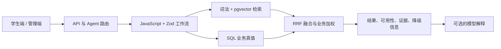

# 智慧食堂双检索与 Agent 架构

本文描述智慧食堂当前批准并在本轮落地的检索架构。系统将“菜品查询”和“智能推荐”拆成两条独立工作流，使用普通 JavaScript、Zod、PostgreSQL、pgvector 和现有 `aiProvider.js`，不使用 LangChain 或 LangGraph 作为生产主链。

## 1. 架构决策

| 层级 | 职责 | 主要实现 |
|---|---|---|
| API 与 Agent | 身份校验、意图路由、工具执行、兼容旧接口 | `server/app.js` |
| 业务工作流 | 参数解释、硬约束、排序、组合、证据组织 | `server/retrievalService.js` + Zod |
| 检索索引 | 租户隔离、词法/向量检索、RRF、索引状态与重建 | `server/retrievalIndex.js` |
| AI 能力 | 生成 1536 维 embedding；可选辅助 Agent 工具选择 | `server/aiProvider.js` |
| 数据真值 | 菜品、菜单、价格、库存、档口、健康档案、权限和订单 | PostgreSQL；SQLite 仅作开发降级 |

核心原则是：**先由数据库确定合法候选和实时状态，再让检索负责排序，最后才允许模型解释结果。**



## 2. SQL 真值与 RAG 边界

以下数据只能从当前租户的数据库读取，不能被 embedding、提示词或模型回答覆盖：

- 租户与权限边界；
- 菜品是否启用、档口是否营业；
- 已发布菜单、餐次和供应时段；
- 菜单实时价格、供应量、已售数量和售罄状态；
- 清真标记、食材、过敏原和用户忌口；
- 订单归属、订单状态及高风险动作确认。

RAG 只负责：

- 理解用户未使用标准字段表达的自然语言；
- 在已授权、已过滤的候选集合内做语义召回；
- 检索健康知识并提供独立引用；
- 为后续自然语言解释提供可引用依据；当前核心排序不依赖模型生成。

菜品证据和健康知识证据必须分组返回。健康文档不能进入菜品结果集，知识建议也不能把不可售菜品描述为当前可点。

## 3. 菜品查询工作流

入口为 `POST /api/dishes/search`，用途是“找菜”，不是生成个性化营养方案。

1. Zod 校验 `query`、`filters`、`sort`、`limit` 和 `offset`。
2. 规则解析预算、餐次、食堂、档口、清真、口味、食材、忌口、过敏原和营养条件；显式过滤字段优先于自然语言推断。
3. 从当前租户的菜品、档口、食堂、已发布菜单和菜单项读取候选，并计算实时 `availability`。
4. 在候选上先执行价格、安全、餐次、位置等硬过滤。
5. 对过滤后的候选执行菜名/食材精确匹配、中文词法排序和可选语义检索。
6. 使用加权 Reciprocal Rank Fusion 合并结果，并提升精确命中和当前可下单菜品。
7. 返回位置、菜单价格、供应状态、匹配原因、分页和可放宽条件；无结果时不生成虚构菜品。

请求与响应的稳定字段：

```text
request:  query, filters, sort, limit, offset
response: interpreted, items, availability, matchReasons,
          suggestedRelaxations, page, meta
```

`items[].availability` 是前端判断“可点、售罄、未上菜单、档口关闭、供应时段外”的唯一依据。

## 4. 智能推荐工作流

入口为 `POST /api/recommend`。`GET /api/recommend` 保留为首屏兼容入口，并转入相同的确定性推荐能力。

1. 加载当前用户健康档案，并合并本次请求的 `profileOverride`；临时条件不自动写回长期档案。
2. 加载当前日期、餐次、已发布菜单、实时供应、环境、偏好和候选菜品。
3. 先执行过敏原、忌口、清真、预算、餐次和可下单状态等硬约束。
4. 在合格候选内融合语义相关度、营养目标、口味、价格、评分、拥挤度与重复食用疲劳度。
5. 默认返回最多 3 个独立备选，每个单独满足预算。
6. 仅当用户明确要求“搭配、套餐、组合”或指定 `options.mode=combination` 时组合菜品，并约束组合总价。
7. 菜品证据写入 `evidence.dishes`，健康知识写入 `evidence.knowledge`。
8. 没有合格的实时菜单时，可返回 `catalog_fallback` 参考，但所有结果必须标记 `orderable:false` 并给出告警。

请求与响应的稳定字段：

```text
request:  query, context, profileOverride, options
response: recommendations, mealPlan, evidence, warnings,
          suggestedRelaxations, meta
```

推荐列表与 `mealPlan` 必须来自同一排序结果，不能分别生成两套不一致的菜品。

## 5. Agent 意图与工具

双检索能力通过三个低风险工具暴露给现有 Agent：

| 意图 | 工具 | 作用 |
|---|---|---|
| `dish_search` | `dish.search` | 查询菜品和实时供应 |
| `meal_recommendation` | `meal.recommend` | 结合档案生成备选或搭配 |
| `knowledge_qa` | `knowledge.search` | 检索健康知识并形成有引用的回答 |

路由约束：

- 订单查询只调用 `orders.mine`，不预加载推荐链；
- 运营问题只对有权限的角色调用分析工具；
- 推荐问题才加载健康档案、菜单和推荐服务；
- `steps` 只记录实际执行过的工具，模型选择结果必须真正执行后才能展示；
- 下单提案必须匹配用户明确点名且当前可售的菜品，不能默认取候选第一项；
- 高风险动作继续进入待确认动作中心，不由模型直接执行。

`aiProvider.js` 的工具选择是可选增强。提供方不可用时，规则意图路由和确定性工作流仍可运行。

## 6. PostgreSQL 与 pgvector

正式环境使用 `pgvector/pgvector:pg17`。迁移位于：

- `migrations/postgres/002_retrieval_pgvector.sql`：显式部署迁移；
- `server/migrations/008_retrieval_pgvector.sql`：`DB_MIGRATE=1` 时的运行时迁移。

迁移会以失败即停止的方式启用 `vector` 和 `pg_trgm`，并提供：

- `embedding vector(1536)`；
- `embedding_model`、`content_hash`、`indexed_at`、`search_text`、`metadata` 和 `chunk_index`；
- `(tenant_id, source_type, source_id, chunk_index)` 唯一约束；
- `search_text gin_trgm_ops` 中文词法索引；
- `embedding vector_cosine_ops` HNSW 索引；
- `retrieval_index_runs` 重建状态记录。

文档 ID 包含租户，所有读写仍同时使用租户列过滤，避免仅依赖字符串 ID 做隔离。菜品和健康文档按内容哈希幂等更新；内容与模型未变化时跳过重复 embedding。

查询 embedding 按“模型 + 规范化查询”在进程内短期缓存。返回维度不是 1536、模型调用失败或未配置模型时，系统记录降级原因并继续使用精确与词法检索。

## 7. 索引生命周期与运维

完整重建：

```bash
# 本地运行时显式加载 PostgreSQL 环境变量，避免静默落到 SQLite
node --env-file=.env scripts/reindex-retrieval.mjs
node --env-file=.env scripts/reindex-retrieval.mjs --tenant=default
node --env-file=.env scripts/reindex-retrieval.mjs --source=dish,health_knowledge
node --env-file=.env scripts/reindex-retrieval.mjs --lexical-only

# Compose 部署直接在 API 容器内执行，复用容器中的 DATABASE_URL
docker compose exec api node scripts/reindex-retrieval.mjs --tenant=default
```

索引服务提供以下运维能力：

- `reindexRetrieval`：按租户幂等重建，可注入菜品、档口、食堂和健康文档快照；
- `syncDishRetrievalDocument`：菜品新增或修改后的单条增量同步；
- `deleteRetrievalSource`：菜品隐藏或删除后移除对应文档；
- `getRetrievalIndexStatus`：返回文档数、已嵌入数、来源统计、最近运行、失败数和索引版本。

管理端通过 `GET /api/admin/retrieval/status` 查看状态，通过 `POST /api/admin/retrieval/reindex` 触发当前租户重建；两者分别受审计读取和菜品写入权限控制，重建动作会写入审计日志。

菜单价格、库存和售罄变化不重新生成 embedding；查询时实时联表读取即可。只有影响菜品语义内容的字段变化才需要重建菜品文档。

部署顺序：

1. 使用支持扩展的 PostgreSQL 镜像启动数据库；
2. 确保迁移账号具备 `CREATE EXTENSION` 权限；
3. 执行迁移并确认 `vector(1536)`、HNSW 和 trigram 索引存在；
4. 执行一次重建脚本；
5. 检查索引状态和失败数量，再开放语义检索流量。

## 8. 降级策略

| 故障 | 行为 |
|---|---|
| embedding 未配置或调用失败 | 使用精确匹配与中文词法检索，返回降级原因 |
| 租户 AI 额度耗尽 | 不再请求 embedding，继续执行词法检索并返回 `AI_QUOTA_EXHAUSTED` |
| embedding 维度不是 1536 | 拒绝写入错误向量，查询降级为词法路径 |
| 健康知识检索失败 | 推荐仍按数据库候选生成，`evidence.knowledge` 为空并告警 |
| 没有当前可售菜单 | 返回明确的不可下单菜品库参考，或返回空结果与放宽建议 |
| PostgreSQL 缺少扩展或索引 | 正式环境启动/索引操作失败，不静默伪装成 pgvector 已启用 |
| SQLite 开发环境 | 保留租户隔离和词法查询；不承诺生产级向量性能 |

任何降级都不能绕过权限、过敏原、忌口、清真、预算、供应和订单确认约束。

## 9. 前端接线

- `DishesView` 的自然语言找菜调用 `POST /api/dishes/search`，结果直接驱动列表、匹配理由、实时可用性和放宽建议。
- `RecommendView` 首屏通过兼容 `GET /api/recommend` 获取确定性推荐；用户继续追问时才进入 Agent 对话。
- `AgentView` 用于运营调试，展示真实意图、实际工具步骤、风险、引用和降级信息，不作为学生端找菜入口。
- 客户端保留旧推荐字段的归一化兼容，迁移期间新旧页面不会因返回字段切换而中断。

## 10. 为什么本期不使用 LangChain / LangGraph

当前两个核心流程都是有限、可测试的业务管线，关键复杂度来自 SQL 真值、硬约束、租户隔离和稳定 API，而不是通用链式抽象。

本期不采用 LangChain，原因是：

- 现有 `aiProvider.js` 已覆盖 embedding、对话和工具选择所需的最小能力；
- 直接 JavaScript 服务更容易审计“先过滤、后召回、再解释”的顺序；
- 减少框架版本、导入路径和隐式回调造成的运行风险；
- Zod、SQL 和普通函数已经能提供清晰的输入输出契约及单元测试边界。

本期不采用 LangGraph，原因是当前 Agent 已有会话、待确认动作和工具执行记录，但双检索本身不需要长时间暂停恢复、分布式状态机或复杂循环。只有未来出现跨天工作流、可恢复的多阶段审批、大量工具重试或人工节点编排时，才重新评估 LangGraph。

旧的 `rag-langchain.js`、`agent-langchain.js`、`vectorstore-pgvector.js` 和静态源码检查测试不再代表生产架构。当前事实来源是可导入、可执行的 `retrievalService.js`、`retrievalIndex.js`、API 测试和工作流测试。

## 11. 验收重点

- 相同菜品 ID 在不同租户间不能互相检索；
- 售罄、供应时段、过敏原、清真和预算约束违规数为零；
- 菜品查询只返回真实菜品证据，健康文档不得混入；
- 推荐列表与餐单保持一致；
- 模型、额度或索引不可用时仍能返回可解释的确定性结果；
- 订单查询不调用推荐工具，高风险动作仍需确认；
- 上线前必须在真实 PostgreSQL + pgvector 环境验证扩展、1536 维写入、HNSW、中文 trigram 和重建脚本。
